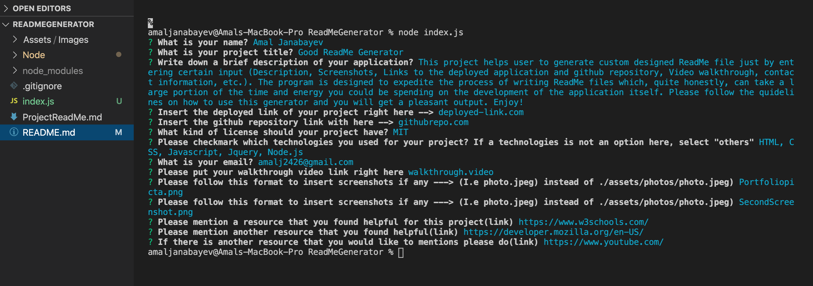
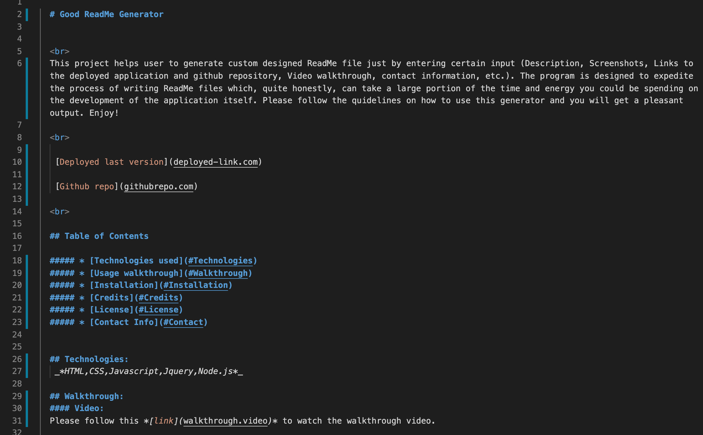

  # Good Read Me Generator 

   
  This application is designed for developers who want to save time on creating a polished complete README.md file. Read me generator lets you create a good file with the following inclusions: (Title, description, links, screenshots, video walthrough, and a lot more!). In order to start using the application you would need to clone the repository from my github account(More information below). You would need to run the following commands in the command line ---> npm install inquirer ---> npm install fs ---> node index.js  

   

   [Deployed last version](deployed-link.com)

   [Github repo](github-repository.com)

   

  ## Table of Contents 
 
  ##### * [Technologies used](#Technologies)
  ##### * [Usage walkthrough](#Walkthrough)
  ##### * [Installation](#Installation)
  ##### * [Credits](#Credits)
  ##### * [License](#License)
  ##### * [Contact Info](#Contact)

  ## Technologies:
   _*HTML,CSS,Javascript,Jquery,Node.js*_

  ## Walkthrough:
  #### Video:
  Please follow this *[link](video.video)* to watch the walkthrough video.

  #### Screenshots:
  
  

  ## Installation:
  Run the following commands in your integrated terminal to initalize the application:

    1. git clone [Repository link you can find under "code" button] (To get the code from a repo)

    2. npm install inquirer

    3. npm install fs

    3. node index.js

    4. Answer all the questions accordingly

    5. Get the output in a form of a new custom generated README.md file
  
  ## Credits:
  [w3schools.com](w3schools.com)
  
  

  ## License: 

  ##### Copyright: Amal Janabayev

  ##### 

  ##### [Licence Link](https://opensource.org/licenses/BSD-3-Clause)

  ## Contact: 

  ##### amalj2426@gmail.com
